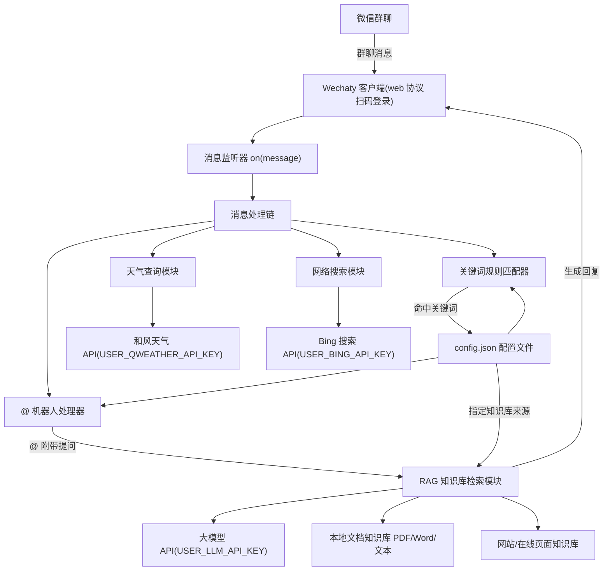

# WeChat 群聊自动回复机器人设计文档

Feature Name: wechat-group-reply-bot
Updated: 2026-08-11

## Description

本系统是基于 Node.js + Wechaty 的微信群聊自动回复机器人。机器人通过 web 协议扫码登录个人微信，监听指定群聊中的消息，实现三类回复能力：

1. **关键词自动回复**：群聊消息命中用户自定义关键词时，回复预设的自定义内容。
2. **@ 机器人特定回复**：群成员 @ 机器人时回复功能引导内容；附带提问时进入知识库检索。
3. **大模型 RAG 知识库检索回复**：从本地文档（PDF/Word/文本）与网站/在线页面构建知识库，基于大模型语义检索回答群成员问题。

机器人通过本地配置文件（`config.json`）管理关键词规则、回复内容与知识库来源，无需修改代码即可调整行为。

## Architecture



### 架构说明

消息处理采用**链式判定**：每条群聊消息依次经过 @ 检测 → 关键词匹配 → （可选）知识库检索，命中即回复，未命中则忽略。@ 附带提问的优先级最高，其次是关键词规则，最后才是知识库兜底检索。

## Components and Interfaces

### 1. 消息监听器 (Listener)

- 监听 Wechaty 的 `message` 事件
- 过滤：仅处理群聊消息（`message.room()` 非空）、文本消息（`message.type()` 为 `MessageType.Text`）、忽略机器人自身消息
- 使用 `room.topic()` 与配置的 `rooms` 白名单比对，仅处理白名单内群聊

### 2. 消息处理链 (Handler)

输入：`Message` 对象；输出：回复内容或 null。

处理顺序：
1. IF 消息为群聊文本消息 → 进入判定
2. IF 消息来自机器人自身 → 忽略
3. IF 文本以"天气"开头 → 天气模块处理
4. IF 文本以"搜索"开头 → 搜索模块处理
5. IF `await message.mentionSelf()` 为 true → 走 @ 处理器
6. ELSE IF 文本命中关键词规则 → 返回关键词回复
7. ELSE → 结束（不回复）

### 3. 天气查询模块 (Weather)

- 读取环境变量 `USER_QWEATHER_API_KEY`（和风天气 API Key）
- 城市名解析：调用 `https://geoapi.qweather.com/v2/city/lookup?location=<城市名>&key=<KEY>` 获取城市 ID
- 实时天气：调用 `https://devapi.qweather.com/v7/weather/now?location=<城市ID>&key=<KEY>`
- 回复格式：`北京 当前天气：多云，温度 25℃，体感 26℃，湿度 60%`
- 未配置 Key / 城市未找到 / API 失败时返回对应提示

### 4. 网络搜索模块 (Search)

- 读取环境变量 `USER_BING_API_KEY`（Bing Web Search API Key）
- 调用 `https://api.bing.microsoft.com/v7.0/search?q=<关键词>&count=<n>`，Header `Ocp-Apim-Subscription-Key`
- 提取结果标题、URL、摘要，按相关度返回前 3 条
- 未配置 Key / 无结果 / API 失败时返回对应提示

### 5. 关键词规则匹配器 (RuleMatcher)

```typescript
interface KeywordRule {
  id: string;
  keywords: string[];
  reply: string;
  mode: "exact" | "contains";
  priority: number;
  enabled: boolean;
}
```

- 支持精确匹配与包含匹配两种模式
- 按 `priority` 降序判定，命中优先级最高的规则即回复
- 精确匹配：文本与关键词完全一致；包含匹配：文本包含任一关键词

### 6. @ 机器人处理器 (MentionHandler)

- `message.mentionSelf()` 为 true 时触发
- 从消息文本中剥离 @ 提及部分，得到 `query`（`message.text()` 中 `@名字` 替换为空后的剩余内容，参考 `message.mention()` 与会话成员解析）
- 若 query 非空 → 调用 RAG 模块检索并回复
- 若 query 为空 → 回复配置中的 `mentionReply`（功能引导内容）

### 7. RAG 知识库检索模块 (RAG)

输入：查询文本；输出：基于知识库的答案。

流程：
1. 构建知识库（启动时一次性加载）：
   - 本地文档：读取 `config.json` 的 `knowledge.docs` 目录，解析 PDF（pdf-parse）、Word（mammoth/docx）、纯文本文件，分块为文本片段
   - 网站/在线页面：抓取 `knowledge.sites` 列表中的页面，提取正文文本，分块为文本片段
2. 向量化：调用大模型 embedding API 将文本块编码为向量
3. 检索：对查询做向量相似度检索，取 Top-K 相关片段（未配置 embedding 时退化为基于分词的文本相关度检索）
4. 生成：将检索片段与查询拼接为 prompt，调用大模型生成答案
5. 兜底：检索无结果时回复配置中的 `noResultReply` 提示

### 8. 大模型客户端 (LLM Client)

- 读取环境变量 `USER_LLM_API_KEY`、`USER_LLM_BASE_URL`、`USER_LLM_MODEL`
- 使用 OpenAI 兼容的 Chat Completions 接口，兼容国内易用服务商（DeepSeek、通义千问等），用户在 `.env` 中自行配置
- 支持 embedding 接口（可选，用于向量检索）
- 未配置 API Key 时：RAG 功能禁用，机器人仅保留关键词与 @ 引导回复能力，启动时输出警告
- 知识库在机器人**启动时构建一次**，向量与文本块存储在**内存 + 本地 JSON 缓存文件**，无外部向量数据库依赖

### 9. 配置管理器 (ConfigManager)

```typescript
interface BotConfig {
  rooms: string[];                          // 监听群名白名单
  keywordRules: KeywordRule[];              // 关键词规则
  mentionReply: string;                     // @ 无提问时的引导回复
  noResultReply: string;                    // 知识库无结果提示
  rag: {
    docs: string[];                         // 本地文档目录/文件路径
    sites: string[];                        // 网站/在线页面 URL
    topK: number;                           // 检索返回片段数
    chunkSize: number;                      // 文本分块大小
    chunkOverlap: number;                   // 分块重叠
  };
  rateLimit: {
    intervalMs: number;                     // 限流窗口
    maxRepliesPerWindow: number;            // 窗口内最大回复数
  };
}
```

- 启动时读取 `config.json`，校验 JSON 格式
- 格式错误时输出明确错误并拒绝启动
- 提供 `config.example.json` 模板

## Data Models

### 文本块 (TextChunk)

```typescript
interface TextChunk {
  id: string;
  source: string;      // 来源标识：文档路径或网站 URL
  text: string;
  embedding?: number[]; // 向量（可选）
}
```

### 检索结果 (RetrievalResult)

```typescript
interface RetrievalResult {
  chunks: TextChunk[];
  query: string;
}
```

### 配置模型 (BotConfig)

见上节 ConfigManager。

## Correctness Properties

- 机器人永不回复自己的消息（幂等，避免死循环）
- 一条消息最多触发一次回复（@ 优先，其次关键词，未命中不回复）
- 关键词按优先级判定，相同优先级时按配置顺序取第一个命中
- 未配置 `USER_LLM_API_KEY` 时系统仍可启动，仅 RAG 功能关闭
- 单个知识源读取失败不影响其他知识源（容错）
- 回复严格执行限流策略，防止被微信风控

## Error Handling

| 场景 | 处理方式 |
|------|---------|
| 微信扫码登录失败/会话过期 | 输出可读错误日志，停止运行 |
| `config.json` 格式错误 | 输出带行号/原因的错误信息，拒绝启动 |
| 单个知识源（文档/网站）读取失败 | 记录警告日志，跳过该源继续 |
| 大模型 API 调用失败/超时 | 记录错误日志，回复 `noResultReply` 兜底文案 |
| 连续消息量过大 | 按 `rateLimit` 限流，超出窗口的回复请求丢弃并记录 |
| 大模型 API Key 未配置 | 启动时警告，禁用 RAG，保留关键词/@ 功能 |

## Test Strategy

- **单元测试**（Jest）：
  - 关键词匹配器：精确/包含/优先级/大小写/空文本
  - 文本分块：chunkSize/chunkOverlap/空文档/超长文本
  - 配置解析：合法配置/非法 JSON/缺字段默认值
  - @ 文本剥离：多种 @ 格式、@ 在文本中间、多个 @
  - 限流器：窗口内次数限制、窗口重置
- **集成测试**：
  - Mock Wechaty message 对象，验证消息处理链完整流程（@ 回复、关键词回复、未命中忽略）
  - 使用本地文本知识库 + mock LLM 客户端验证 RAG 全链路
- **手工验证**：
  - 本地启动机器人扫码登录，在测试群验证三类回复
  - 修改 `config.json` 后重启，验证新规则生效

## References

[^1]: (Website) - [Wechaty 官方文档](https://wechaty.js.org/docs/)
[^2]: (Website) - [Wechaty message 事件与 mentionSelf API](https://github.com/wechaty/wechaty)
